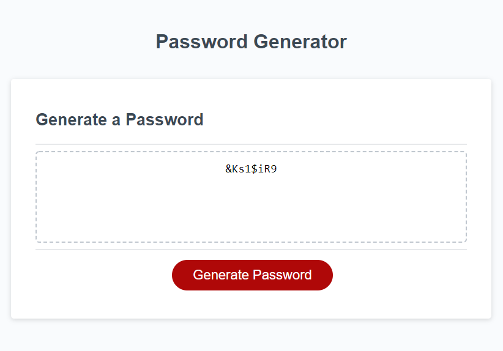

# Unique Password Generator

## Description
This web application randomly generates a unique password while meeting users criteria. It prompts the user for a desired length and whether it should enable the addition of lowercase, uppercase, numbers and special characters. After gathering the users input, it generates a password that has the user selected criterias.

This web application is used making HTML, CSS, and Java Script.

## How is it randomized
After gathering the user criteria, random characters from specific arrays were added to make a pre-shuffeld password array. This array is passed into a array shuffeler which swaps element locations and return a final product which a shuffled password. 

## Deployed Site

## Deployed Site Link
[Password Generator Site](https://hmanjun.github.io/Unique-Password-Generator/)

## License
[Link](https://github.com/hmanjun/Unique-Password-Generator/blob/main/LICENSE)